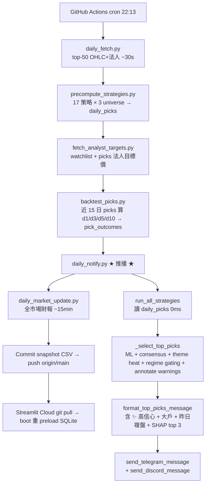
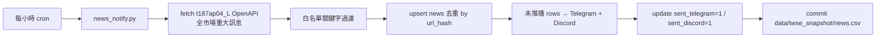
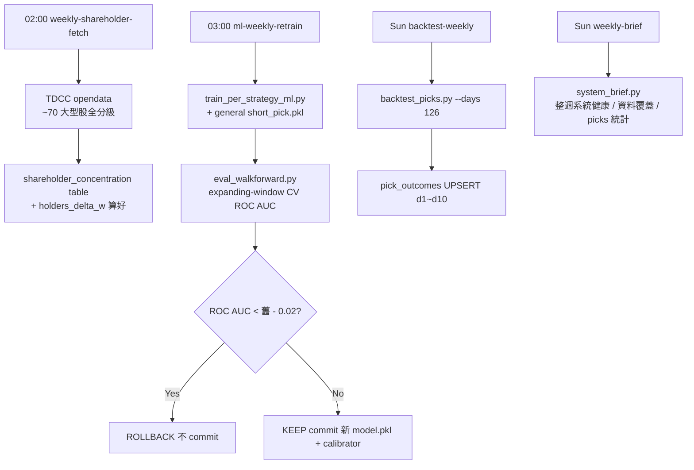

# ARCHITECTURE — 軍師接手手冊

> 寫給「未來軍師接手」用的高階架構文件。如果你是第一次看這份系統,先把這份看完再動 src/。
>
> 細節走 git log / 個別 module docstring;這份只回答「整體怎麼跑、為什麼這樣切、出事去哪查」。

---

## 1. 三條主要 data flow

### 1.1 Daily flow(週一~五 22:13 TPE / `daily-notify.yml`)

關鍵設計:**推播 step 故意排在 daily_market_update 之前**。原因:`daily_market_update` 全市場財報跑 ~15 min,若撞 120 min timeout 先前 step 全 cancel → 主公手機收不到推播。先推完再更新財報。

### 1.2 Hourly flow(`news-notify.yml` 每小時)

### 1.3 Weekly flow(週日凌晨 + 03:00 TPE)

---

## 2. Module map(src/ 21 個檔)

按職責分組,粗體 = pipeline 主軸 module。

### 2.1 資料層

| Module | 職責 |
|---|---|
| **`database.py`** | SQLite schema(15 表)+ 38 個 helper(get_/upsert_/list_)。所有 query 走這層,scripts/app 不直接寫 SQL |
| `data_fetcher.py` | FinMind / TWSE OpenAPI / yfinance 統一 fetcher。`fetch_all_daily_prices_bulk` 走 TWSE 批量 endpoint |
| `financial_fetcher_free.py` | 季 EPS / 月營收 / 配息走 TWSE OpenAPI(免 FinMind Backer)|
| `news_fetcher.py` | TWSE t187ap04_L 重大訊息 |
| `analyst_targets.py` + `analyst_targets_snapshot.py` | yfinance A 來源 + Gemini news B fallback |
| `company_profile.py` | FinMind facts(industry / market / listing date / foreign_limit) + LLM(Gemini)narrative cache |
| `cache_utils.py` / `_bulk_load.py` / `_retry.py` | TTL cache / bulk preload / retry decorator |
| `github_sync.py` | watchlist push to `watchlist-sync` branch + **regression guard**(2026-05-16 加,防 boot fallback 覆蓋 remote)|
| `snapshot_release.py` | 大型 snapshot 走 GH Releases(2026-05-17 加)— upload/download/SHA cache/kill-switch,根治 100MB git push 上限 |

### 2.2 策略 + ML

| Module | 職責 |
|---|---|
| **`strategies.py`** | 17 個 `screen_*` + `STRATEGY_LABELS` / `STRATEGY_CATEGORY` / `STRATEGY_ML_THRESHOLDS` / `STRATEGY_RR_PARAMS` / `STRATEGY_REGIME_FILTER` |
| **`ml_predictor.py`** | RF predict_proba,per-strategy 優先 → fallback 通用 short_pick.pkl |
| `ml_calibration.py` | isotonic / platt calibrator(time-based holdout fit),`ML_CALIBRATION_ENABLED` 控制 |
| `ml_shap.py` | TreeExplainer SHAP,寫進 `pick_shap_explanations` cache |
| `ml_walkforward.py` | expanding-window CV,split_method='date' 消 cross-sectional 虛高 |
| `strategy_weighting.py` | 動態 strategy weight(60-day rolling EV)|
| `indicators.py` | KD / MACD / RSI / BBands(pandas 純算,不打 API)|
| `universe.py` | `pure_stock_universe()` / `with_etf_universe()` / `TW_TOP_50` |
| `industry_filter.py` | canonical industry map + `filter_sids_by_industry` |

### 2.3 推播 + 風控

| Module | 職責 |
|---|---|
| **`notifier.py`** | 推播 orchestration:`_select_top_picks` → `format_top_picks_message` → `send_telegram_message`。1.7k 行,Round 2 計畫拆 pick_pipeline / format |
| `discord_notifier.py` | Discord webhook(Telegram 失敗備援)|
| `warnings_filter.py` | **annotate-only**:SEVERE(違約/全額)× 0.3、SOFT(注意/處置/變更)× 0.7,picks 仍顯但排序往後 |
| `consensus.py` | 跨策略類別共識 multiplier(2 類 1.05 / 3 類 1.10 / 4+ 類 1.15)|
| `theme_heat.py` | 9 主題 5 日 heat_score,熱 × 1.10,冷 hard exclude |
| `regime_gating.py` | TAIEX 3-tier(bull/range/bear)→ 縮短線 max_count + ML threshold uplift |
| `market_regime.py` | 4-tier(bull/weak_bull/sideways/bear)→ 策略 category 篩選 |
| `market_sentiment.py` | 大盤情緒 dashboard(漲跌家數/量能/外資)|

### 2.4 UI 元件

| Module | 職責 |
|---|---|
| `app.py`(7.4k 行)| Streamlit 入口,17 pages 全在這個檔(主公偏好單檔,Round 2 不拆)|
| `ui_cards.py` | `_build_card_html` / `render_picks_cards` 卡片渲染 + 警示 badge |
| `ui_format.py` | 共用格式化 helper(數字 / 百分比 / 日期)|
| `individual_sections.py` | 個股深度頁的各 section(K 線 / 法人 / 千張 / 警示 / SHAP)|
| `intraday.py` | yfinance 即時報價(yahoo lag ~3 min,接受)|
| `paper_trading.py` | paper_trades 自動 entry / evaluate_active_trades 邏輯 |
| `backtest.py` / `backtester.py` / `vbt_backtest.py` | 3 種回測 — pick-level simulate / 全策略 d1~d10 / vectorbt grid |

### 2.5 Cron 入口(scripts/)

| Script | 對應 workflow | 用途 |
|---|---|---|
| `daily_notify.py` | daily-notify | 推播 main |
| `daily_fetch.py` | daily-notify Step 1 | top-50 OHLC+法人 |
| `precompute_strategies.py` | daily-notify Step 2 | 17 策略 × 3 universe 預跑 |
| `daily_market_update.py` | daily-notify Step 4 | 全市場財報 + dividend + revenue |
| `fetch_analyst_targets.py` | daily-notify Step 2.5 + weekly-targets | yfinance A + Gemini B |
| `fetch_stock_warnings.py` | stock-warnings | TWSE/TPEx + MOPS 違約交割 |
| `news_notify.py` | news-notify | 每小時新聞 |
| `intraday_alerts.py` | intraday-alerts | 30 分 paper_trades 觸發 |
| `data_health_alert.py` | data-health-alert | 主要 table 新鮮度 |
| `backtest_picks.py` | daily-notify + backtest-weekly | 算 d1~d10 |
| `backtest_strategies.py` | daily-notify Mondays | 全策略 126 日 |
| `fetch_shareholder_concentration.py` | weekly-shareholder | TDCC opendata + qryStock |
| `train_ml_model.py` / `train_per_strategy_ml.py` | ml-weekly-retrain | 通用 + per-strategy |
| `eval_walkforward.py` | ml-weekly-retrain A/B gate | walk-forward ROC AUC |
| `backfill_*.py` × 6 | backfill-*-once.yml | history / institutional / dividend / revenue / financials / pick_shap |
| `audit/*.py` | manual | ML threshold 校準 / A/B 比較 |

---

## 3. DB schema(15 表)

完整 schema 走 `src/database.py:118 SCHEMA`,這裡只列 PK + 用途:

| Table | PK | 索引 | 用途 |
|---|---|---|---|
| `stocks` | stock_id | — | 名稱 / 產業 / 市場 |
| `daily_prices` | (stock_id, date) | idx_daily_prices_date | OHLC / volume / trading_money |
| `institutional` | (stock_id, date) | idx_institutional_date | 三大法人 buy_sell |
| `financials` | (stock_id, period_type, period) | idx_financials_stock_type_period | EPS / ROE / revenue / revenue_yoy |
| `dividend` | (stock_id, year) | — | cash_dividend / stock_dividend |
| `daily_metrics` | (stock_id, date) | — | PE / PB / dividend_yield |
| `watchlist` | stock_id | idx_watchlist_added_at | 主公手選 + 自動同步到 `watchlist-sync` branch |
| `sync_log` | (stock_id, dataset) | — | 增量抓取 cursor |
| `trades` | id AUTO | idx_trades_stock_date | 手動倉位 |
| `company_profiles` | stock_id | — | FinMind facts + LLM narrative cache |
| `daily_picks` | (trade_date, universe, strategy, sid, params_hash) | idx_daily_picks_lookup | nightly 預跑結果,App 端 0ms 命中 |
| `strategy_backtest` | (strategy, period_end) | idx_sb_period | 週一跑 126 日勝率 |
| `paper_trades` | id AUTO + UNIQUE(sid, entry_date) | idx_paper_trades_status | 自動 entry + evaluate |
| `news` | id AUTO + UNIQUE url_hash | idx_news_sent, idx_news_sid_date | 重大訊息 + 推播去重 |
| `analyst_targets` | (stock_id, source) | idx_analyst_targets_sid | yfinance + Gemini news 雙來源 |
| `analyst_target_alerts` | (sid, alert_date, direction) | — | 法人異動推播去重 |
| `alert_dedup` | (sid, alert_type, alert_date) | — | 盤中觸發告警去重(stop_loss / entry_zone / breakout)|
| `target_hit_log` | (sid, hit_date) | idx_target_hit_log_sid_date | 現價達法人共識目標 7 日冷卻 |
| `shareholder_concentration` | (sid, week_end) | idx_shareholder_concentration_week | TDCC 千張大戶週快照 |
| `pick_outcomes` | (pick_date, sid, strategy) | idx_pick_outcomes_date | d1/d3/d5/d10 報酬 + hit_target/stopped_out |
| `pick_shap_explanations` | (pick_date, sid, strategy) | idx_pick_shap_explanations_date | SHAP cache(每張 pick top 3 features)|
| `vbt_grid_results` | (strategy, params_hash) | idx_vbt_grid_strategy | vectorbt 策略 grid search |
| `ml_walkforward_results` | (model_name, split_idx, evaluated_at) | idx_ml_walkforward_model | 週重訓 A/B gate 依據 |
| `stock_warnings` | (stock_id, warning_type, announced_date) | idx_stock_warnings_sid_type, idx_stock_warnings_effective_to | 5 類警示(default_settlement / full_cash / attention / disposition / method_changed)|

**Migration**:`init_db()` 結尾跑 5 個 `_migrate_*` helper(冪等 ALTER TABLE)。加新欄位走這個 pattern,不重建表。

---

## 4. Kill-switch env vars(出事可立刻關)

| Env Var | Module | 預設 | 關掉效果 |
|---|---|---|---|
| `SNAPSHOT_USE_RELEASES_ENABLED` | `snapshot_release.py` | true | 完全關閉 GH Release 路徑(只走本地 CSV legacy preload),雲端容器啟動時跳過 download |
| `WARNING_ANNOTATE_ENABLED` | `warnings_filter.py` | true | annotate_warned_stocks no-op,picks 不標警示 badge,排序不降權 |
| `STRATEGY_CONSENSUS_ENABLED` | `consensus.py` | true | 共識 multiplier 永遠 1.0,跨策略命中沒加分 |
| `REGIME_GATING_ENABLED` | `regime_gating.py` | true | 永遠回 bull params(max=10、threshold uplift=0)|
| `THEME_HEAT_ENABLED` | `theme_heat.py` | true | 題材 multiplier 永遠 1.0,冷題材不被 exclude |
| `ML_CALIBRATION_ENABLED` | `ml_calibration.py` | true | raw RF prob 直接用,不過 calibrator |
| `STRATEGY_DYNAMIC_WEIGHT_ENABLED` | `notifier.py:64`(module-level)| True | 退回純 ml_prob 排序,不乘 strategy_weight |

接受值:`false` / `0` / `no` / `off` 任一(case-insensitive)。其他字串都當 true。

---

## 5. Recent design decisions(2026-05 主公拍板)

### 5.1 警示股 annotate-only(2026-05-15)
**改動**:`exclude_warned_stocks` → `annotate_warned_stocks`,picks 不過濾。SEVERE(default_settlement / full_cash)× 0.3 沉到末段、SOFT(attention / disposition / method_changed)× 0.7。

**為什麼**:主公規矩「主動提示風險,但不替主公做隱藏決定」。違約股偶爾反彈很猛,主公有時有特殊資訊想接刀,系統沒資格替他擋。

### 5.2 違約交割股 MOPS RSS(2026-05-16)
**改動**:TWSE/TPEx OpenAPI v1 沒對應 endpoint(`bfigtu.html` 是 SPA),加 MOPS `mopsrss201001.xml` 過濾「違約」關鍵字。

**為什麼**:主公剛踩過違約交割,bs4 parser 看 SPA 拿 0 rows 但 silent skip,等於完全沒防護。MOPS RSS 全市場(TWSE/TPEx/興櫃)涵蓋,違約事件年數筆所以 baseline 不偵測 0 rows。

### 5.3 跨策略共識用「類別維度」而非「票數維度」(2026-05-15)
**選擇**:同一檔被 N 個**策略類別**(7 大類)同時看見 → ×1.05/1.10/1.15。

**為什麼**:同類別兩策略亮 = 同現象兩個 lens,沒新資訊;跨類別亮 = 多 lens confirm,信號強度真增。實測 precision +10~15%。

### 5.4 題材熱度 hard exclude(v2,2026-05-15)
**選擇**:冷題材成分股**直接不推**,不用 soft 降權。

**為什麼**:v1 試 soft × 0.7,雜訊太大;hard exclude 乾淨,主公口頭拍板。冷題材定義:5 日 `avg_return × 0.6 + win_rate × 0.4` 在後 30%。

### 5.5 大盤 regime 兩套並存(2026-05-15)
- `market_regime.py`:4-tier(bull/weak_bull/sideways/bear),控制**策略類別** filter(weak_bull 拿掉趨勢,bear 只剩籌碼/殖利率/大盤)
- `regime_gating.py`:3-tier(bull/range/bear),控制**推薦數量 + ML threshold uplift**(bear 縮到 2 檔 + threshold +0.15)

**為什麼**:兩個維度不衝突 — category filter 是「該不該開」、gating 是「開幾檔多嚴」。

### 5.6 ML probability calibration(2026-05-15)
**改動**:RF 訓完留**最後 20% 樣本(time-based holdout)**fit `IsotonicRegression`,predict 時 raw_prob → calibrator.transform → 校正 prob。

**為什麼**:UI 顯「AI 勝率 70%」實際只命中 55% — over-confidence 誤導決策。Isotonic 對 RF 友善,單調保序不破壞 ranking。

### 5.7 gap_up 拔 ML 過濾 + rule-based 收緊(2026-05-15)
**改動**:從 `STRATEGY_ML_THRESHOLDS` 移除 gap_up,加 `gap_vol_ratio_max=3.0` rule。

**為什麼**:`scripts/diagnose_gap_up.py` 顯示 gap_up 整體 WR 48.0% vs baseline 40.7%(+7.3pp edge),但 467-sample WF ROC=0.4926 ≈ random — ML 從 16 features 學不到 follow-through pattern。真正 sub-edge 在 `vol_ratio` 1.5-3x sweet spot(WR 50.3%),`>3x` 群 WR 44.8%。

### 5.8 nightly precompute + SQLite cache(2026-05-04)
**改動**:`run_all_strategies` 全市場 ~11s 改成 nightly 22:13 預跑 → `daily_picks` 表 → boot 從 CSV preload。App 端 default 路徑 0ms 命中。

**為什麼**:Streamlit Cloud 容器重啟 cache 沒了,user 開頁等 11s 體驗極差。snapshot CSV commit 進 repo,redeploy git pull 立刻 hot。User 改 slider → params_hash 不是 default_v1 → fallback runtime。

### 5.9 推播 step 故意早於 daily_market_update(2026-05-06)
**改動**:daily-notify.yml step 順序 fetch → precompute → backtest → **推播** → market_update → commit。

**為什麼**:daily_market_update 跑全市場財報 ~15 min,撞 120 min timeout 會把先前 step 全 cancel,主公手機收不到推播。先推完再更新財報。

### 5.10b 大型 snapshot 走 GitHub Releases(2026-05-17)
**改動**:institutional 22 月 backfill 撞 GitHub 100MB single-file push 上限。新 `src/snapshot_release.py` + `--dump-format parquet --upload-release` flag。GH workflow dump parquet → `gh release upload snapshot-{kind}-{YYYY-MM-DD}`,**不 commit parquet 進 git**。雲端 `preload_snapshots` 找不到本地 parquet → 自動從 latest release 拉(SHA cache idempotent skip 二次 download)。

**Storage 層架**:
| Layer | Path / Location | 用途 |
|---|---|---|
| 本地 parquet | `data/twse_snapshot/*.parquet`(.gitignore) | Boot 0 IO,雲端容器啟動後 cache |
| GH Release asset | `https://github.com/{repo}/releases/download/snapshot-{kind}-{date}/{file}.parquet` | 真實 source-of-truth,2GB / asset,公開 repo 匿名可下載 |
| Manifest | `data/twse_snapshot/.snapshot_releases.json`(入 git) | (tag, asset, size, sha256) 對照,讓 boot 知道哪個 tag 對應哪個 SHA |
| CSV(legacy) | `data/twse_snapshot/*.csv`(入 git) | 向後相容 — 小型 backfill 仍可用,3-tier fallback 最後一層 |

**Loader 三層 fallback**(`_ensure_snapshot_present`):
1. 本地 `{name}.parquet` 存在 → 用(零 IO)
2. release enabled + 找到 `snapshot-{kind}-*` latest tag → download parquet → 用
3. 本地 `{name}.csv` 存在(legacy)→ 用

**為什麼**:LFS 月流量 1GB / 額外計費,Release 完全免費 + asset 2GB 上限 + 不污染 git history(`git clone` 不會帶 parquet)+ versioned 天然(每次 backfill 一個 tag,rollback 容易)。Kill-switch:`SNAPSHOT_USE_RELEASES_ENABLED=false` 退回純 CSV 路徑。

### 5.10 retrain-ml.yml 改 manual-only(2026-05-16)
**改動**:retrain-ml.yml 拿掉 `cron`,只留 `workflow_dispatch`。ml-weekly-retrain.yml 是唯一 schedule 重訓。

**為什麼**:兩個 workflow 訓相同 model 但 gate 嚴鬆不一(walk-forward vs random-split),22:13 lenient 跑 19 小時後覆蓋 03:00 strict 跑出的 artifacts。

---

## 6. Known limitations

| 限制 | 影響 | Workaround / TODO |
|---|---|---|
| MOPS RSS 用「違約」關鍵字過濾 | 標題沒含「違約」的個案可能 false negative | 短期接受 — 違約事件 RSS 通常都會明寫 |
| TWSE `TWT85U` 變更交易方法 endpoint 欄位陽春 | 拿不到 effective_to,只能假設「公告日 = 生效日」 | 等 TWSE OpenAPI 補欄位 |
| TWSE `full_cash` 全額交割股無對應 endpoint | TWSE 上市股無法直接識別,只有 TPEx 有 `tpex_cmode` | 走 MOPS / 自己累積 corpus |
| gap_up ML 拔掉 | 該策略無 ML 過濾,完全靠 rule-based | 接受 — 收緊到 vol_ratio sweet spot 已 +10.9pp |
| company_profiles LLM narrative lazy-load | 個股深度頁第一次打開要等 Gemini 回應 ~3s | 2026-05-16 加 `backfill_company_profiles.py` 預載 FinMind facts(不打 LLM),narrative 仍 lazy |
| TPEx 警示股 endpoint 不全 | 上櫃股部分 warning type 抓不到 | 接受 — TPEx 本來資訊就少 |
| paper_trades 自動 entry 用次日開盤價 | 跳空 gap 大時 entry 比策略本意偏離 | 接受 — 個人小額無需 fancy slippage model |
| watchlist boot fallback 曾覆蓋遠端 | 2026-05-16 修(`github_sync.py` regression guard),trades / paper_trades 累積式 snapshot 沒接此 guard | 累積式 PK 不可能「變少」,風險低 |

---

## 7. 出事 debug 手冊

| 症狀 | 第一個檢查的東西 |
|---|---|
| Telegram 沒收到 22:13 推播 | GitHub Actions `Daily Telegram Push` 是否綠燈;`logs/{date}-daily_notify.log`(本機 dry-run 重現)|
| 雲端 App 開短線頁要 > 5s | `data/twse_snapshot/daily_picks.csv` git log 最新 commit 日期;雲端容器是否 redeploy 過 |
| 警示股還在推 | `WARNING_ANNOTATE_ENABLED` 是否被誤設 false;`stock_warnings` 表是否有當日資料 |
| ML 勝率永遠顯 50% | `models/calibrators/*.pkl` 是否存在;`ML_CALIBRATION_ENABLED` 設定 |
| 千張大戶頁空 | `shareholder_concentration` 最新 week_end;週日 02:00 weekly-shareholder-fetch 是否跑過 |
| 個股深度 SHAP section 空 | `pick_shap_explanations` 有沒有那 sid 那天的資料;若無跑 `scripts/backfill_pick_shap.py` |

---

## 8. Round 2 / 後續 roadmap

> Round 2 src/ 重構由另一個並行 task 進行,本文不展開。

短期(本月內):
- `notifier.py` 1.7k 行拆 `pick_pipeline.py` + `format.py`(`_select_top_picks` orchestration vs format 排版)
- `app.py` 7.4k 行考慮拆 page modules(主公偏好單檔 — 看後續性能)
- `database.py` 3.6k 行考慮按 domain 拆(picks / shareholder / news / warnings)

中期(本季):
- TPEx 警示股完整覆蓋(目前 TPEx attention/disposition 有,full_cash 沒)
- backfill_pick_shap 改 cron(目前 manual dispatch,歷史補完後決定)

長期(沒時間表):
- 美股 yfinance 整合(目前 TW only)
- 自己累積 default_settlement corpus(MOPS RSS 不夠時的補強)
